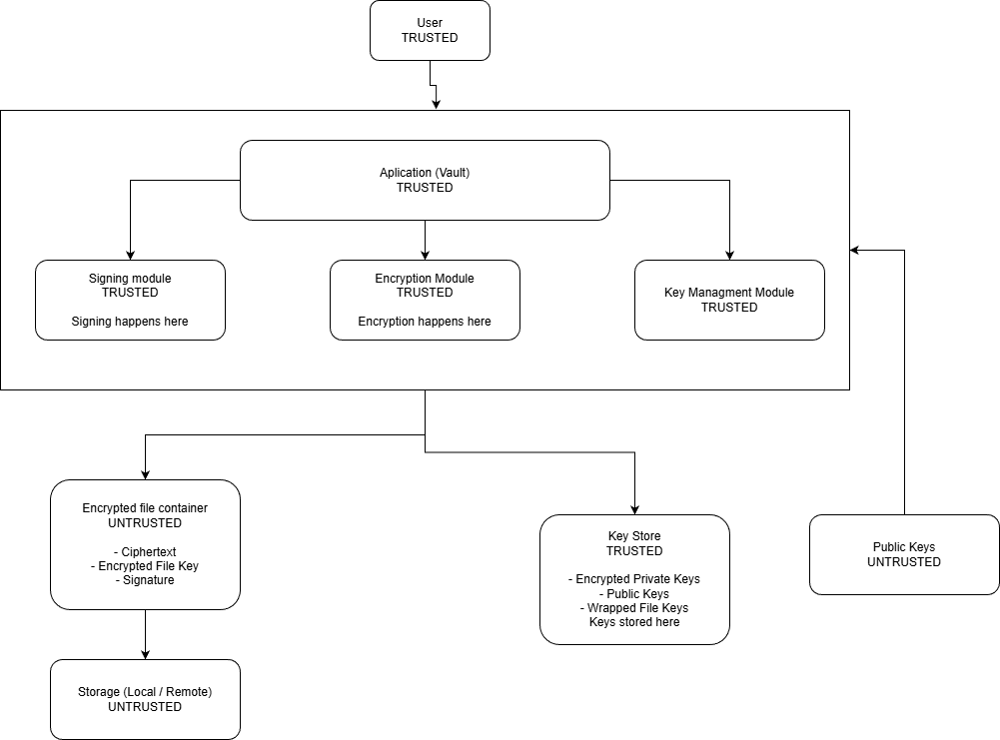

# Final Proyect
We are Computer Engineering students, and we are working on a new app to implement cryptographic algorithms to protect information.
Our names are:
## Rodriguez Garcia Javier Antonio
### Product Manager / Full Stack

## Gutierrez Avila Tristan Bernardo
### Dessigner / Full Stack / UX UI / Tester

## Pacheco Chavarría Arturo Iván
### Backend / DB / Full stack

## Rodríguez Montes de Oca Andrés
### Full Stack  / Security / Dev OPS 

# Architecture & Threat Model 

## 1. System Overview

### System Purpose

The central problem the **Secure Digital Document Vault** addresses is the reliance on the security of the transport channel or on third-party storage. Today, when uploading a file to the cloud or sending it by email, it is implicitly assumed that the provider will protect the data.

This system starts from the opposite premise: storage and the network should be treated as insecure by default (“Zero Trust”).

The goal is to generate digital containers that protect the information by themselves, ensuring confidentiality, integrity, and proof of origin regardless of where they are stored or how they are transmitted.

### Core Functionality

The system is implemented as a command-line application (CLI) that manages the lifecycle of a protected document through four main mechanisms:

- **Content Encryption with Integrity Protection:** The file is encrypted so that only authorized users can read it. In addition, controls are applied so that any unauthorized modification of the content automatically invalidates the container.

- **Secure Sharing:** The document is encrypted only once. The encryption key is encapsulated individually for each authorized recipient using their respective public keys.

- **Digital Signatures:** The sender cryptographically signs the entire container. This allows the recipient to verify the sender’s identity and ensure the file was not altered in transit before attempting to decrypt it.

- **Local Key Protection:** The user’s private keys are stored encrypted on disk, protected by a master password. This ensures that stealing the key file alone is not enough to compromise the user’s identity.

### Out of Scope

To keep the design strictly focused on the cryptographic protection of the file, the following design limitations are established:

- **No endpoint security guarantees:** If the operating system is compromised (keyloggers, malware, memory access, among others), the vault’s security cannot be guaranteed.

- **No full PKI infrastructure:** Certification Authorities (CAs) and online revocation mechanisms (OCSP) are not implemented. Public-key validation is assumed to happen through direct exchange.

- **No password recovery:** By secure design, there are no backdoors. If the user loses the master password, access to their keys and documents is permanently lost.

- **No storage management:** The system processes and generates `.enc` (or similar) files, but it does not handle cloud sync, automatic backups, or version control.

## 2. Architecture Diagram
 

## 3. Security Requirements

**R1 — Confidentiality of file contents**  
The system must ensure that the file contents are cryptographically inaccessible to any entity that does not possess the corresponding private key of an authorized recipient. This guarantee must hold even if an adversary obtains full access to the container file (`.enc`), whether stored on disk or intercepted in transit.

**R2 — Data integrity**  
Any unauthorized modification of the encrypted content—whether due to bit corruption, truncation, or intentional tampering—must invalidate the container. If the integrity check fails, the system must not decrypt or output any partial content.

**R3 — Sender authenticity**  
The recipient must be able to cryptographically verify that the file was produced by the expected sender. The system must reject any container whose digital signature does not match the corresponding sender public key, preventing identity spoofing.

**R4 — Private key protection**  
The user’s private keys must never be stored in plaintext on the device. The Key Store must remain encrypted using a key derived from the user’s password, so that physical access to the key file alone is not sufficient to compromise the owner’s identity without knowing that password.

**R5 — Integrity of metadata and container structure**  
The system must detect any alteration of the container header or structure, including the recipient list, format version, or any parameters required for decryption. If metadata has been modified with the intent to change system behavior or mislead the recipient, the process must abort immediately.

**R6 — Verify before decrypt**  
The container’s authenticity and integrity must be validated before any decryption operation is performed. If the signature or authentication mechanism is invalid, the system must not process the encrypted content, avoiding attacks that exploit malicious inputs.

**R7 — Cryptographic access control**  
Only identities explicitly selected by the sender during container creation may recover the key required to decrypt the file. There must be no alternative mechanism or “master key” that enables access for unauthorized third parties.

## 4. Threat Model

### Assets

| Asset | Description | Sensitivity |
|--------|-------------|-------------|
| File contents | Documents stored inside `.vault` containers | **HIGH** — primary protection target |
| File metadata | Filename, timestamps, recipient identifiers in the header | **MEDIUM** — may reveal context |
| Private keys | Signing key, decryption key | **CRITICAL** — can break all security |
| User password | Used to derive the key encryption key | **HIGH** — enables private key decryption |
| Signature validity | Signatures attached to containers | **HIGH** — guarantees non-repudiation |
| Ephemeral symmetric keys | AES-256-GCM keys used per container | **HIGH** — decrypts a single container |
| Key backup files | Encrypted exports of Key Store (`.backup`) | **HIGH** — equivalent to Key Store |
| Nonces | 96-bit values used in AES-GCM | **CRITICAL** — reuse destroys confidentiality |

### Adversaries

| Adversary | Capabilities | Limitations |
|-----------|-------------|-------------|
| **A1 — External attacker (storage access)** | Can read, copy and modify all `.vault` files on disk or cloud. Can observe file sizes and access patterns. | Cannot access the user's running process memory. Does not know the user's password. Cannot break AES-256-GCM. |
| **A2 — Malicious recipient** | Possesses their own private key and can decrypt containers addressed to them. Can attempt to modify containers and re-sign with their key. | Cannot derive other recipients' keys. Cannot forge the sender's signature. Cannot decrypt symKeys wrapped for other recipients. |
| **A3 — Metadata analyst** | Observes file sizes, timestamps, filenames in headers and recipient count. | Cannot decrypt ciphertext. Cannot forge signatures. |
| **A4 — Temporary device access** | Gains brief physical access to the user's machine (e.g. 5 minutes). Could copy the Key Store file or backup files. | Does not know the user's password. Cannot install persistent malware (assumption). Cannot read process memory during execution. |
| **A5 — Network eavesdropper** | Intercepts `.vault` containers in transit over unencrypted channels. | Same as A1 — cannot decrypt without private key. Cannot forge signatures. |
| **A6 — Attacker with backup access** | Obtains the `.backup` file from USB, cloud or email. Can attempt offline brute-force. | Does not know the password. |

### What Attackers CAN Do
- Read and modify any `.vault` file on the storage medium.
- Attempt offline brute-force attacks against the password-protected Key Store or backups.
- Replay or re-order encrypted containers.
- Attempt to strip or substitute signatures (will be detected by verify-before-decrypt).
- Perform statistical analysis on encrypted containers (file size, timing).
- If recipient, decrypt containers addressed to them but not to others.

### What Attackers CANNOT Do
- Read process memory on the user's machine while the vault is running.
- Break AES-256-GCM with current computational resources.
- Reuse a nonce to break AES-GCM.
- Force users to choose weak passwords.
- Install persistent malware or keyloggers (this is OS/endpoint concern).
- Decrypt a container addressed to another recipient without that recipient's private key.

## 5. Trust Assumptions

The security guarantees described in the requirements (confidentiality, integrity, and authenticity) rely on the following assumptions. If any of these assumptions do not hold, the system may partially or fully lose its security properties.

**A1 — Reasonably trusted execution environment**  
It is assumed that the operating system and the environment where the vault runs are not compromised (no persistent malware, keyloggers, rootkits, or real-time malicious memory inspection). If the endpoint is compromised, an attacker could capture passwords, keys in use, or plaintext.

**A2 — User password protection**  
It is assumed that the user protects their master password (does not share it, does not reuse it in an obvious way, and avoids storing it in plaintext). The security of the Key Store depends on the strength and confidentiality of this password.

**A3 — Secure randomness generation**  
It is assumed that the platform provides a cryptographically secure random number generator (CSPRNG). This is required for values such as nonces/IVs and session keys.

**A4 — Authentic public keys (no full PKI)**  
It is assumed that the public keys of senders and recipients are authentic (not replaced by an attacker). Since a full PKI infrastructure is not implemented, public-key validation is performed through a mechanism external to the system (direct exchange, fingerprints, a trusted channel, etc.).

**A5 — Storage and network are untrusted**  
It is assumed that the storage and/or transmission medium can be observed and modified by an adversary (“untrusted storage/untrusted network” model). The system must remain secure under this assumption by detecting modifications and preventing content leakage.

**A6 — Software and cryptographic dependency integrity**  
It is assumed that the system implementation and the cryptographic libraries used have not been maliciously altered (e.g., supply-chain attacks) and are executed from legitimate binaries/packages.

**A7 — Basic identity management**  
It is assumed that each cryptographic identity (key pair) corresponds to a real user and that the user understands who they are sharing with (for example, by verifying a fingerprint during key exchange). The system cannot “guess” whether the user selected the correct recipient public key.

**A8 — Limited local access by attackers**  
It is assumed that an attacker with temporary access to the device may read stored files, but does not maintain persistent control during normal system use (for example, cannot observe the process while the user is actively decrypting).

## 6. Attack Surface Review

| Entry Point | What Could Go Wrong | Security Property at Risk |
|-------------|---------------------|--------------------------|
| **File input (plaintext upload)** | Malicious file triggers buffer overflow or path traversal during read. Attacker could craft filenames to escape the directory. | Integrity, Availability |
| **Metadata parsing** | Crafted header in `.vault` file causes injection or parsing errors. Attacker could manipulate filename, timestamp or recipient count to cause crashes or bypass checks. | Integrity, Confidentiality |
| **Key import/export** | Importing malformed or malicious public key could cause crashes or key confusion (wrong key bound to wrong identity). Exporting to insecure location leaks public keys. | Authenticity, Confidentiality |
| **Password entry** | Shoulder surfing, keylogging or weak password enables brute-force of Key Store. Timing attacks on password verification could leak information. | Confidentiality of private keys |
| **Sharing workflow** | Encrypting to wrong public key (mislabelled in directory) sends data to unintended recipient. Attacker could swap public keys in the directory. | Confidentiality |
| **Signature verification** | Skipping verification or incorrect implementation allows attacker to present forged documents as authentic. Timing attacks on signature verification. | Authenticity, Integrity |
| **CLI arguments** | Command injection via unsanitized filenames or paths passed as arguments. E.g.: `--file \"'; rm -rf /\"` could execute arbitrary commands. | Integrity, Availability |
| **Encrypted container format** | Attacker modifies nonce, salt or ciphertext blocks in the container. | Integrity, Confidentiality |
| **Key backup/recovery** | Backup file stored in insecure location enables offline brute-force. | Confidentiality of private keys |
| **Multi-recipient key wrapping** | Error encrypting `symKey` for a recipient could send key in plaintext or encrypted with wrong public key. | Confidentiality, Integrity |
| **Nonce generation** | Nonce reuse with same key in AES-GCM enables XOR of plaintexts and destroys confidentiality. | Confidentiality |
| **Verify-before-decrypt ordering** | If verification is skipped or order reversed (decrypt→verify), system processes potentially manipulated ciphertext before verifying authenticity, opening door to side-channel attacks. | Authenticity, Integrity |

## 7. Design Constraints Derived from Requirements
| Requirement                                  | Design Constraint                                           |
| -------------------------------------------- | ----------------------------------------------------------- |
| Confidentiality of file contents             | Must use **AEAD** (AES-GCM or ChaCha20-Poly1305)            |
| Integrity of encrypted data                  | Must verify **AEAD tag** before decrypt output              |
| Authenticity of sender                       | Must implement **digital signatures**                       |
| Verify before trust                          | Must **verify signature before decrypt**                    |
| Private keys must be protected               | Must encrypt private keys with **KDF + KEK**                |
| Weak passwords must be mitigated             | Must use **Argon2id/PBKDF2** with salt and cost             |
| Only intended recipients can access file key | Must use **hybrid encryption** (per-recipient key wrapping) |
| Metadata tampering must be detected          | Must authenticate metadata as **AAD** and sign manifest     |
| Nonce reuse must be prevented                | Must generate **unique nonce per encryption**               |
| Randomness must be unpredictable             | Must use **CSPRNG only**                                    |
| Storage is untrusted                         | Must store only **encrypted containers**                    |
| Downgrade attacks must be blocked            | Must enforce **versioned crypto policy**                    |
| Malformed input must not be processed        | Must use **strict fail-closed parsing**                     |
| Key import can be abused                     | Must validate **key format/size/fingerprint**               |
| Secrets must not leak in logs                | Must implement **redacted security logging**                |
| Security must be implementable               | Must prioritize **AEAD + Signatures + Hybrid + KDF**        |
